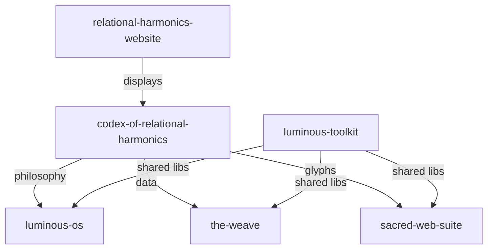

# 🏗️ Repository Restructuring Strategy

## Current Situation
- **Single Monorepo**: 5,807 files, 100+ directories, multiple distinct projects
- **Mixed Concerns**: Philosophy, OS development, web apps, AI systems
- **Difficult to Manage**: Too large for efficient development

## Recommended Repository Structure

### 1. **luminous-os** (Primary Focus)
```
github.com/Luminous-Dynamics/luminous-os
```
**Contents:**
- Stillpoint Kernel
- Sacred bootloader and init system  
- Mycelial filesystem
- Mandala UI
- OS-specific components

**Why Separate:** This is becoming your primary project and deserves its own repository with focused development, issues, and releases.

### 2. **codex-of-relational-harmonics** (Original/Philosophy)
```
github.com/Luminous-Dynamics/codex-of-relational-harmonics
```
**Contents:**
- Original 87 glyphs data
- Philosophical texts
- Core concepts documentation
- Glyph practice guides

**Why Keep:** This is the philosophical foundation that everything else builds upon.

### 3. **the-weave** (Agent Network Platform)
```
github.com/Luminous-Dynamics/the-weave
```
**Contents:**
- Unified agent network CLI
- Sacred Council Hub
- Multi-agent coordination
- Agent communication protocols

**Why Separate:** This is a complete platform for AI agent coordination that others could use.

### 4. **sacred-web-suite** (Web Applications)
```
github.com/Luminous-Dynamics/sacred-web-suite
```
**Contents:**
- All dashboards (consolidated)
- Sacred demos
- Web-based tools
- PWA applications

**Why Separate:** Web apps have different deployment needs and dependencies.

### 5. **relational-harmonics-website** 
```
github.com/Luminous-Dynamics/relational-harmonics-website
```
**Contents:**
- Public website
- Dojo interface
- Documentation site
- Marketing materials

**Why Separate:** Public-facing website with different security/deployment needs.

### 6. **luminous-toolkit** (Shared Libraries)
```
github.com/Luminous-Dynamics/luminous-toolkit
```
**Contents:**
- Sacred geometry calculations
- Field coherence algorithms
- Shared TypeScript/Rust utilities
- Common components

**Why Separate:** Reusable packages that multiple projects depend on.

## Migration Plan

### Phase 1: Prepare (Before Split)
```bash
# 1. Tag current state
git tag pre-split-monorepo-final

# 2. Create comprehensive backup
tar -czf erc-complete-backup-$(date +%Y%m%d).tar.gz .

# 3. Document all inter-dependencies
# Create DEPENDENCIES.md listing what depends on what
```

### Phase 2: Extract LuminousOS (Highest Priority)
```bash
# Use git filter-branch to extract with history
git filter-branch --subdirectory-filter luminous-os/ -- --all

# Create new repo
gh repo create Luminous-Dynamics/luminous-os --public --description "Consciousness-first operating system"

# Push to new repo
git remote add luminous-origin https://github.com/Luminous-Dynamics/luminous-os.git
git push luminous-origin --all
git push luminous-origin --tags
```

### Phase 3: Extract The Weave
```bash
# Extract the-weave, modules/agent-network, sacred-council-hub
git filter-branch --index-filter '
  git rm -rf --cached --ignore-unmatch $(git ls-files | grep -v "^the-weave/\|^modules/agent-network/\|sacred-council")
' -- --all
```

### Phase 4: Create Shared Libraries
Package reusable code as npm/cargo packages:
```json
// Package.json for @luminous/toolkit
{
  "name": "@luminous/sacred-geometry",
  "version": "1.0.0",
  "main": "dist/index.js"
}
```

### Phase 5: Update Main Repo
Transform `codex-of-relational-harmonics` into focused philosophy repo:
- Keep only glyph data and documentation
- Remove all implementation code
- Add links to new repos

## Repository Relationships



## Benefits of Multi-Repo

1. **Focused Development**: Each repo has clear purpose
2. **Independent Releases**: Version and deploy separately  
3. **Better Permissions**: Control access per project
4. **Cleaner History**: Relevant commits only
5. **Faster CI/CD**: Smaller repos = faster builds
6. **Clear Dependencies**: Explicit package imports

## Implementation Steps

### Week 1: LuminousOS Extraction
1. Create new luminous-os repository
2. Extract with full history
3. Set up CI/CD pipeline
4. Update README and documentation

### Week 2: The Weave Platform
1. Extract agent network components
2. Create unified platform repo
3. Package as deployable system
4. Document API and usage

### Week 3: Web Applications
1. Consolidate all dashboards
2. Create sacred-web-suite repo
3. Set up web deployment pipeline
4. Optimize for production

### Week 4: Cleanup and Links
1. Clean up main repo
2. Add inter-repo documentation
3. Update all import paths
4. Create migration guide

## Monorepo Considerations

**Keep as Monorepo:**
- Shared libraries (luminous-toolkit)
- Web suite (related dashboards)

**Definitely Separate:**
- LuminousOS (distinct project)
- The Weave (platform product)
- Public website (different deploy)

## Repository Settings

### All Repos Should Have:
- README.md with clear purpose
- LICENSE file (GPL-3.0 or MIT)
- CONTRIBUTING.md guidelines
- Issue templates
- CI/CD workflows
- Security policies

### Suggested Visibility:
- **Public**: luminous-os, the-weave, toolkit
- **Private**: Internal tools, experiments
- **Public Archive**: Old implementations

## Cross-Repo Workflows

### Shared Releases:
```yaml
# When toolkit updates, trigger dependent builds
on:
  repository_dispatch:
    types: [toolkit-updated]
```

### Documentation Site:
- Aggregates docs from all repos
- Single source of truth
- Auto-updates on releases

## Success Metrics

- Build time: 10min → 2min per repo
- Deploy complexity: Simplified
- Developer onboarding: 1 day → 2 hours
- Issue management: Focused per project
- Code ownership: Clear boundaries

---

*"From one, many - each with sacred purpose"* 🌟