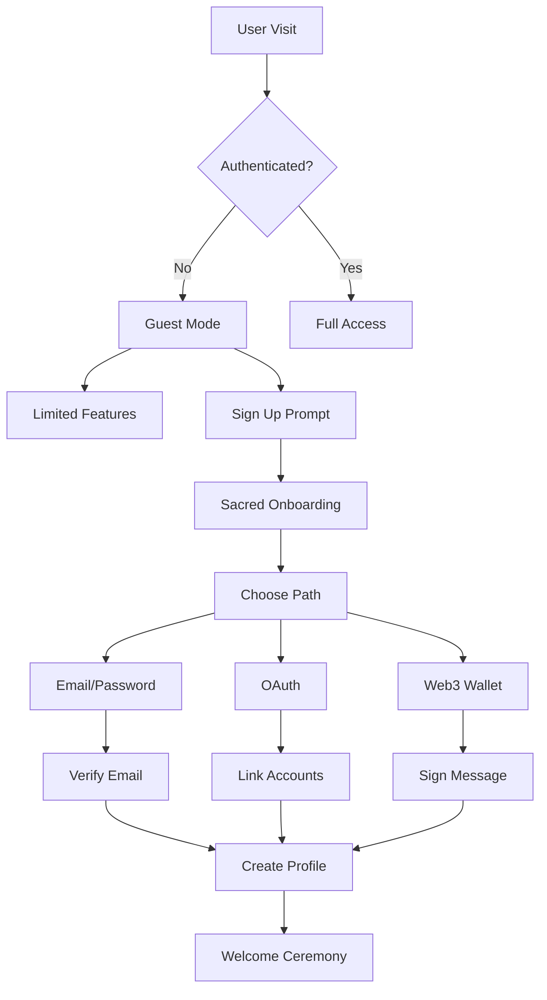

# LuminousOS Authentication System Design

## Overview
A consciousness-aware authentication system that respects user sovereignty while maintaining security. Built on Supabase for reliability with custom extensions for sacred features.

## Core Principles
1. **Sovereignty First**: Users own their data and spiritual journey
2. **Sacred Identity**: Support for spiritual names alongside legal names  
3. **Progressive Trust**: Deeper features unlock with practice
4. **Graceful Degradation**: Guest mode for exploring without commitment
5. **Privacy by Design**: Minimal data collection, maximum user control

## Architecture

### Authentication Flow


### Sacred Onboarding Process
```typescript
interface SacredOnboarding {
  // Step 1: Initial Connection
  welcomeBreath: {
    duration: 3, // seconds
    message: "Take three deep breaths to arrive"
  },
  
  // Step 2: Identity Formation
  sacredName: {
    prompt: "What name does your soul wish to be called?",
    validation: MinLength(3),
    suggestion: generateSacredName()
  },
  
  // Step 3: Intention Setting
  intention: {
    prompt: "What brings you to this sacred digital space?",
    options: [
      "Personal coherence practice",
      "Shadow work and healing",
      "Community connection",
      "Consciousness exploration",
      "Sacred activism"
    ]
  },
  
  // Step 4: Initial Coherence Reading
  baselineCoherence: {
    method: "guided_breathing",
    duration: 60, // seconds
    establishes: "personal_baseline"
  },
  
  // Step 5: Privacy Choices
  privacyPreferences: {
    shareCoherence: boolean,
    publicProfile: boolean,
    allowInvitations: boolean,
    dataRetention: "1year" | "forever" | "delete_on_logout"
  }
}
```

## Implementation Details

### 1. Supabase Configuration
```typescript
// supabase/config.ts
import { createClient } from '@supabase/supabase-js'

const supabaseUrl = process.env.VITE_SUPABASE_URL
const supabaseAnonKey = process.env.VITE_SUPABASE_ANON_KEY

export const supabase = createClient(supabaseUrl, supabaseAnonKey, {
  auth: {
    autoRefreshToken: true,
    persistSession: true,
    detectSessionInUrl: true,
    flowType: 'pkce', // Most secure for SPAs
    storage: {
      // Custom storage for sacred session data
      getItem: (key) => {
        const item = localStorage.getItem(key)
        if (item) {
          const parsed = JSON.parse(item)
          // Decrypt coherence data if present
          if (parsed.coherenceData) {
            parsed.coherenceData = decryptCoherence(parsed.coherenceData)
          }
          return JSON.stringify(parsed)
        }
        return null
      },
      setItem: (key, value) => {
        const parsed = JSON.parse(value)
        // Encrypt sensitive coherence data
        if (parsed.coherenceData) {
          parsed.coherenceData = encryptCoherence(parsed.coherenceData)
        }
        localStorage.setItem(key, JSON.stringify(parsed))
      },
      removeItem: (key) => localStorage.removeItem(key)
    }
  }
})
```

### 2. Authentication Service
```typescript
// services/auth.service.ts
export class AuthService {
  private coherenceThreshold = 0.6 // Required for certain features
  
  async signUp(credentials: SignUpCredentials): Promise<User> {
    // Standard signup
    const { data, error } = await supabase.auth.signUp({
      email: credentials.email,
      password: credentials.password,
      options: {
        data: {
          sacred_name: credentials.sacredName,
          intention: credentials.intention,
          coherence_baseline: credentials.coherenceBaseline
        }
      }
    })
    
    if (error) throw new AuthError(error.message)
    
    // Create extended profile
    await this.createUserProfile(data.user.id, credentials)
    
    // Send sacred welcome email
    await this.sendWelcomeCeremony(data.user.email, credentials.sacredName)
    
    return data.user
  }
  
  async signIn(credentials: SignInCredentials): Promise<Session> {
    const { data, error } = await supabase.auth.signInWithPassword({
      email: credentials.email,
      password: credentials.password
    })
    
    if (error) throw new AuthError(error.message)
    
    // Update last seen
    await this.updateLastSeen(data.user.id)
    
    // Check coherence requirements
    if (await this.checkCoherenceGate(data.user.id)) {
      await this.unlockAdvancedFeatures(data.user.id)
    }
    
    return data.session
  }
  
  async signInWithProvider(provider: 'google' | 'github' | 'discord'): Promise<void> {
    const { error } = await supabase.auth.signInWithOAuth({
      provider,
      options: {
        redirectTo: `${window.location.origin}/auth/callback`,
        scopes: provider === 'discord' ? 'identify email' : undefined
      }
    })
    
    if (error) throw new AuthError(error.message)
  }
  
  async signOut(): Promise<void> {
    // Save practice state before logout
    await this.savePracticeState()
    
    // Graceful coherence wind-down
    await this.coherenceWindDown()
    
    const { error } = await supabase.auth.signOut()
    if (error) throw new AuthError(error.message)
  }
  
  // Sacred features
  
  async checkCoherenceGate(userId: string): Promise<boolean> {
    const currentCoherence = await this.getCurrentCoherence(userId)
    return currentCoherence >= this.coherenceThreshold
  }
  
  async unlockAdvancedFeatures(userId: string): Promise<void> {
    // Unlock shadow work, advanced glyphs, group ceremonies
    await supabase
      .from('user_features')
      .upsert({
        user_id: userId,
        shadow_work_unlocked: true,
        advanced_glyphs_unlocked: true,
        group_ceremonies_unlocked: true,
        unlocked_at: new Date().toISOString()
      })
  }
  
  private async coherenceWindDown(): Promise<void> {
    // 3-second coherence wind-down with breathing guide
    // Prevents jarring logout experience
    if (window.sacredAI?.stopBinauralBeat) {
      window.sacredAI.stopBinauralBeat()
    }
  }
}
```

### 3. Session Management
```typescript
// hooks/useAuth.ts
export function useAuth() {
  const [user, setUser] = useState<User | null>(null)
  const [session, setSession] = useState<Session | null>(null)
  const [loading, setLoading] = useState(true)
  const [coherenceUnlocked, setCoherenceUnlocked] = useState(false)
  
  useEffect(() => {
    // Get initial session
    supabase.auth.getSession().then(({ data: { session } }) => {
      setSession(session)
      setUser(session?.user ?? null)
      setLoading(false)
    })
    
    // Listen for auth changes
    const { data: { subscription } } = supabase.auth.onAuthStateChange(
      async (event, session) => {
        setSession(session)
        setUser(session?.user ?? null)
        
        if (event === 'SIGNED_IN') {
          // Start coherence monitoring
          startCoherenceMonitoring(session.user.id)
          
          // Check feature unlocks
          const unlocked = await authService.checkCoherenceGate(session.user.id)
          setCoherenceUnlocked(unlocked)
        }
        
        if (event === 'SIGNED_OUT') {
          // Clean up coherence monitoring
          stopCoherenceMonitoring()
        }
        
        if (event === 'TOKEN_REFRESHED') {
          // Seamless token refresh
          console.log('Session refreshed')
        }
      }
    )
    
    return () => subscription.unsubscribe()
  }, [])
  
  return {
    user,
    session,
    loading,
    coherenceUnlocked,
    signUp: authService.signUp,
    signIn: authService.signIn,
    signOut: authService.signOut,
    updateProfile: authService.updateProfile
  }
}
```

### 4. Protected Routes
```typescript
// components/ProtectedRoute.tsx
interface ProtectedRouteProps {
  children: React.ReactNode
  requireCoherence?: number
  fallback?: React.ReactNode
}

export function ProtectedRoute({ 
  children, 
  requireCoherence = 0,
  fallback = <GuestMode />
}: ProtectedRouteProps) {
  const { user, loading, coherenceUnlocked } = useAuth()
  const [currentCoherence, setCurrentCoherence] = useState(0.5)
  
  useEffect(() => {
    if (user) {
      // Subscribe to coherence updates
      const unsubscribe = coherenceService.subscribe(user.id, (coherence) => {
        setCurrentCoherence(coherence)
      })
      return unsubscribe
    }
  }, [user])
  
  if (loading) {
    return <SacredLoader />
  }
  
  if (!user) {
    return fallback || <Navigate to="/welcome" />
  }
  
  if (requireCoherence > 0 && currentCoherence < requireCoherence) {
    return (
      <CoherenceGate 
        required={requireCoherence}
        current={currentCoherence}
        onPracticeComplete={() => window.location.reload()}
      />
    )
  }
  
  return <>{children}</>
}
```

### 5. Guest Mode
```typescript
// components/GuestMode.tsx
export function GuestMode() {
  const [guestSession, setGuestSession] = useState<GuestSession | null>(null)
  
  useEffect(() => {
    // Create ephemeral guest session
    const session: GuestSession = {
      id: `guest-${Date.now()}`,
      startedAt: new Date(),
      features: {
        basicGlyphs: true,
        coherenceTracking: true,
        limitedPractices: 5,
        binaural: true,
        save: false
      }
    }
    
    setGuestSession(session)
    
    // Show gentle signup prompts
    const promptTimer = setTimeout(() => {
      showSacredPrompt({
        title: "Continue Your Journey",
        message: "Create a free account to save your practice and unlock all features",
        actions: [
          { label: "Sign Up", action: () => navigate('/signup') },
          { label: "Continue as Guest", action: () => {} }
        ]
      })
    }, 300000) // 5 minutes
    
    return () => clearTimeout(promptTimer)
  }, [])
  
  return (
    <div className="guest-mode">
      <div className="guest-banner">
        Exploring as Guest • {guestSession?.features.limitedPractices} practices remaining
      </div>
      <LuminousOS limitedFeatures={true} />
    </div>
  )
}
```

## Security Measures

### 1. Row Level Security (RLS)
```sql
-- Enable RLS on all tables
ALTER TABLE users ENABLE ROW LEVEL SECURITY;
ALTER TABLE coherence_readings ENABLE ROW LEVEL SECURITY;
ALTER TABLE glyph_practices ENABLE ROW LEVEL SECURITY;

-- Users can only see their own data
CREATE POLICY "Users can view own profile" 
  ON users FOR SELECT 
  USING (auth.uid() = id);

CREATE POLICY "Users can update own profile" 
  ON users FOR UPDATE 
  USING (auth.uid() = id);

-- Coherence data is private by default
CREATE POLICY "Users can view own coherence" 
  ON coherence_readings FOR SELECT 
  USING (auth.uid() = user_id);

-- But can be shared if user opts in
CREATE POLICY "Public coherence if opted in" 
  ON coherence_readings FOR SELECT 
  USING (
    EXISTS (
      SELECT 1 FROM user_profiles 
      WHERE user_id = coherence_readings.user_id 
      AND privacy_settings->>'coherence_visible' = 'true'
    )
  );
```

### 2. API Security
```typescript
// middleware/auth.middleware.ts
export async function requireAuth(req: Request, res: Response, next: NextFunction) {
  const token = req.headers.authorization?.replace('Bearer ', '')
  
  if (!token) {
    return res.status(401).json({ error: 'No authorization token' })
  }
  
  try {
    const { data: { user }, error } = await supabase.auth.getUser(token)
    
    if (error || !user) {
      return res.status(401).json({ error: 'Invalid token' })
    }
    
    // Check if user is active
    const { data: profile } = await supabase
      .from('users')
      .select('is_active, coherence_baseline')
      .eq('id', user.id)
      .single()
    
    if (!profile?.is_active) {
      return res.status(403).json({ error: 'Account suspended' })
    }
    
    // Attach user to request
    req.user = {
      ...user,
      coherenceBaseline: profile.coherence_baseline
    }
    
    next()
  } catch (error) {
    return res.status(500).json({ error: 'Authentication error' })
  }
}

// Rate limiting by coherence level
export function coherenceRateLimit(req: Request, res: Response, next: NextFunction) {
  const userCoherence = req.user?.coherenceBaseline || 0.5
  
  // Higher coherence = higher rate limits
  const requestsPerMinute = Math.floor(60 + (userCoherence * 240)) // 60-300 rpm
  
  rateLimiter({
    windowMs: 60 * 1000,
    max: requestsPerMinute,
    message: 'Slow down, breathe, find your center'
  })(req, res, next)
}
```

## Privacy & Data Protection

### User Rights
1. **Right to Access**: Download all data in JSON/CSV
2. **Right to Deletion**: Complete account removal
3. **Right to Portability**: Export practice history
4. **Right to Correction**: Edit any personal data
5. **Right to Restriction**: Limit data processing

### Data Minimization
- No tracking pixels
- No third-party analytics  
- No behavioral profiling
- No data sales ever
- Local-first architecture

### Encryption
- Passwords: Argon2id hashing
- Sensitive data: AES-256 encryption
- Connections: TLS 1.3 only
- Coherence data: Optional client-side encryption
- Quantum-safe: Preparing for post-quantum cryptography

## Testing Strategy

### Unit Tests
```typescript
describe('AuthService', () => {
  it('should create user with sacred name', async () => {
    const user = await authService.signUp({
      email: 'seeker@example.com',
      password: 'sacred123',
      sacredName: 'Aurora',
      intention: 'consciousness_exploration'
    })
    
    expect(user.user_metadata.sacred_name).toBe('Aurora')
  })
  
  it('should enforce coherence gates', async () => {
    const user = await createTestUser({ coherence: 0.4 })
    const hasAccess = await authService.checkCoherenceGate(user.id)
    
    expect(hasAccess).toBe(false)
  })
  
  it('should handle sacred logout', async () => {
    const spy = jest.spyOn(window.sacredAI, 'stopBinauralBeat')
    await authService.signOut()
    
    expect(spy).toHaveBeenCalled()
  })
})
```

### E2E Tests
```typescript
test('Sacred onboarding flow', async ({ page }) => {
  await page.goto('/welcome')
  
  // Welcome breath
  await expect(page.locator('.breath-guide')).toBeVisible()
  await page.waitForTimeout(3000)
  
  // Sacred name
  await page.fill('[name="sacredName"]', 'Starweaver')
  
  // Intention
  await page.click('text=Shadow work and healing')
  
  // Coherence baseline
  await expect(page.locator('.coherence-measurement')).toBeVisible()
  await page.waitForTimeout(60000)
  
  // Privacy choices
  await page.click('[name="shareCoherence"]')
  
  // Complete signup
  await page.click('text=Begin Journey')
  
  // Should see welcome ceremony
  await expect(page.locator('.welcome-ceremony')).toBeVisible()
})
```

## Monitoring & Observability

### Auth Metrics
- Signup completion rate
- Login success rate
- Session duration
- Coherence unlock rate
- Guest to user conversion
- Password reset frequency

### Sacred Metrics
- Average coherence at signup
- Intention distribution
- Sacred name patterns
- Privacy preference trends
- Feature unlock progression

## Future Enhancements

### Phase 2
- WebAuthn/Passkeys support
- Decentralized identity (DID)
- Social recovery mechanisms
- Biometric authentication
- Voice recognition login

### Phase 3
- Zero-knowledge proofs
- Homomorphic encryption for coherence
- Federated LuminousOS instances
- Cross-device synchronization
- Offline-first auth