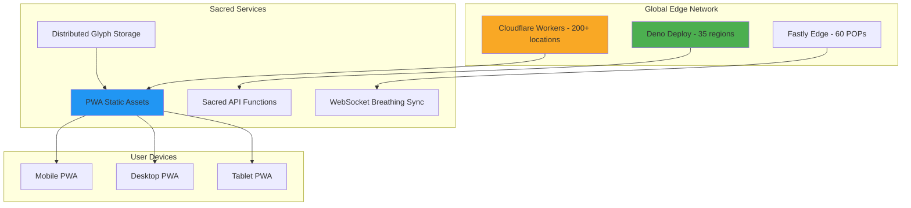

# 🌐 Sacred Scalable Architecture - Security + Scale

**Vision**: Consciousness technology that serves millions while protecting each sacred breath  
**Principle**: Scale without sacrifice, security without barriers  

## 🏗️ Sacred Scalability Stack

### **Edge-First Architecture**



## 🔒 Security at Scale

### **1. Zero-Trust Edge Architecture**

```javascript
// Cloudflare Worker - Sacred API Gateway
export default {
  async fetch(request, env) {
    // Rate limiting per user
    const clientId = request.headers.get('CF-Connecting-IP');
    const rateLimitKey = `rate_limit:${clientId}`;
    
    const currentRequests = await env.RATE_LIMITER.get(rateLimitKey) || 0;
    if (currentRequests > 100) { // 100 requests per minute
      return new Response('Sacred pause required', { status: 429 });
    }
    
    // Increment rate limit
    await env.RATE_LIMITER.put(rateLimitKey, currentRequests + 1, {
      expirationTtl: 60
    });
    
    // Validate request signature
    const signature = request.headers.get('X-Sacred-Signature');
    if (!await validateSignature(request, signature, env.SACRED_KEY)) {
      return new Response('Invalid sacred signature', { status: 401 });
    }
    
    // Route to appropriate service
    const url = new URL(request.url);
    switch (url.pathname) {
      case '/api/breathing/sync':
        return handleBreathingSync(request, env);
      case '/api/field/coherence':
        return handleFieldCoherence(request, env);
      case '/api/glyph/recommend':
        return handleGlyphRecommendation(request, env);
      default:
        return new Response('Not found', { status: 404 });
    }
  }
};

async function validateSignature(request, signature, secretKey) {
  const encoder = new TextEncoder();
  const data = encoder.encode(await request.text());
  const key = await crypto.subtle.importKey(
    'raw',
    encoder.encode(secretKey),
    { name: 'HMAC', hash: 'SHA-256' },
    false,
    ['verify']
  );
  
  return crypto.subtle.verify(
    'HMAC',
    key,
    hexToArrayBuffer(signature),
    data
  );
}
```

### **2. Distributed Session Management**

```javascript
// Deno Deploy - Stateless Sacred Sessions
import { create, verify } from "https://deno.land/x/djwt@v2.8/mod.ts";

const key = await crypto.subtle.generateKey(
  { name: "HMAC", hash: "SHA-256" },
  true,
  ["sign", "verify"],
);

export async function createSacredSession(practitionerId: string) {
  const jwt = await create(
    { alg: "HS256", typ: "JWT" },
    {
      sub: practitionerId,
      iat: Date.now(),
      exp: Date.now() + (24 * 60 * 60 * 1000), // 24 hours
      sacred: true,
      coherence: 0.67
    },
    key
  );
  
  return jwt;
}

export async function verifySacredSession(token: string) {
  try {
    const payload = await verify(token, key);
    return payload;
  } catch {
    return null;
  }
}

// Edge KV for distributed state
const kv = await Deno.openKv();

export async function syncFieldCoherence(sessionId: string, coherence: number) {
  const key = ["field", "coherence", sessionId];
  const result = await kv.atomic()
    .set(key, coherence)
    .commit();
  
  // Broadcast to other edges
  await broadcastCoherence(sessionId, coherence);
  
  return result.ok;
}
```

### **3. Content Integrity at Scale**

```javascript
// Subresource Integrity for all sacred resources
const SACRED_RESOURCES = {
  'breathing-consciousness.js': 'sha384-Li9vy3DqF8tnTXuiaAJuML3ky+er10rcgNR/VqsVpcw+ThHmYcwiB1pbOxEbzJr7',
  'voice-guidance.js': 'sha384-MnbQb6KOIZ7PC0WeqAeKRGYJDcJeJmPc0D0M7MDKSaBxwVJI4e3X+l5+dX9aQS7j',
  'sacred-glyphs.json': 'sha384-oqVuAfXRKap7fdgcCY5uykM6+R9GqQ8K/uxy9rx7HNQlGYl1kPzQho1wx4JwY8wC'
};

// Service Worker with integrity checking
self.addEventListener('fetch', event => {
  const url = new URL(event.request.url);
  const resource = url.pathname.substring(1);
  
  if (SACRED_RESOURCES[resource]) {
    event.respondWith(
      fetch(event.request).then(response => {
        // Verify integrity
        return verifyIntegrity(response, SACRED_RESOURCES[resource])
          .then(isValid => {
            if (isValid) {
              return response;
            }
            throw new Error('Sacred resource integrity check failed');
          });
      })
    );
  }
});
```

## 🚀 Scalability Solutions

### **1. Static Asset Distribution**

```yaml
# Cloudflare Pages deployment
name: sacred-breathing-pwa
compatibility_date: 2025-06-30

[build]
command = "npm run build"
publish = "dist/"

[[redirects]]
from = "/api/*"
to = "https://sacred-api.deno.dev/:splat"
status = 200

[[headers]]
for = "/*"
[headers.values]
X-Frame-Options = "DENY"
X-Content-Type-Options = "nosniff"
Content-Security-Policy = "default-src 'self'; script-src 'self' 'sha256-...'"
Permissions-Policy = "geolocation=(), microphone=(), camera=()"

# Cache sacred assets
[[headers]]
for = "/sacred-*.js"
[headers.values]
Cache-Control = "public, max-age=31536000, immutable"

[[headers]]
for = "/glyphs/*.json"
[headers.values]
Cache-Control = "public, max-age=86400, stale-while-revalidate=604800"
```

### **2. WebSocket Sacred Breathing Sync**

```javascript
// Durable Objects for real-time breathing coordination
export class BreathingRoom {
  constructor(state, env) {
    this.state = state;
    this.env = env;
    this.sessions = new Map();
    this.fieldCoherence = 0.67;
  }

  async fetch(request) {
    const upgradeHeader = request.headers.get('Upgrade');
    if (upgradeHeader !== 'websocket') {
      return new Response('Expected WebSocket', { status: 426 });
    }

    const [client, server] = Object.values(new WebSocketPair());
    await this.handleSession(server);

    return new Response(null, {
      status: 101,
      webSocket: client,
    });
  }

  async handleSession(websocket) {
    websocket.accept();
    
    const sessionId = crypto.randomUUID();
    this.sessions.set(sessionId, websocket);

    websocket.addEventListener('message', async (msg) => {
      const data = JSON.parse(msg.data);
      
      switch (data.type) {
        case 'breathing_phase':
          // Broadcast to all participants
          this.broadcast({
            type: 'collective_breathing',
            phase: data.phase,
            coherence: this.fieldCoherence,
            participants: this.sessions.size
          }, sessionId);
          break;
          
        case 'coherence_update':
          // Update collective field coherence
          await this.updateFieldCoherence(data.coherence);
          break;
      }
    });

    websocket.addEventListener('close', () => {
      this.sessions.delete(sessionId);
      this.updateParticipantCount();
    });

    // Send initial state
    websocket.send(JSON.stringify({
      type: 'welcome',
      sessionId,
      fieldCoherence: this.fieldCoherence,
      participants: this.sessions.size
    }));
  }

  broadcast(message, excludeSession = null) {
    const msg = JSON.stringify(message);
    
    this.sessions.forEach((ws, sessionId) => {
      if (sessionId !== excludeSession) {
        try {
          ws.send(msg);
        } catch (err) {
          // Remove dead connections
          this.sessions.delete(sessionId);
        }
      }
    });
  }

  async updateFieldCoherence(individualCoherence) {
    // Weighted average with existing field
    this.fieldCoherence = (this.fieldCoherence * 0.9) + (individualCoherence * 0.1);
    
    // Persist to durable storage
    await this.state.storage.put('fieldCoherence', this.fieldCoherence);
    
    // Broadcast update
    this.broadcast({
      type: 'field_coherence_update',
      coherence: this.fieldCoherence,
      timestamp: Date.now()
    });
  }
}
```

### **3. IPFS Sacred Content Network**

```javascript
// Distributed glyph storage with IPFS
import { create } from 'ipfs-http-client';

const ipfs = create({
  host: 'ipfs.infura.io',
  port: 5001,
  protocol: 'https',
  headers: {
    authorization: 'Basic ' + btoa(PROJECT_ID + ':' + PROJECT_SECRET)
  }
});

// Pin sacred glyphs
export async function distributeSacredGlyphs() {
  const glyphs = await loadAllGlyphs();
  
  for (const glyph of glyphs) {
    const file = {
      path: `glyphs/${glyph.id}.json`,
      content: JSON.stringify(glyph)
    };
    
    const result = await ipfs.add(file, {
      pin: true,
      wrapWithDirectory: true
    });
    
    console.log(`Sacred glyph ${glyph.id} distributed:`, result.cid.toString());
    
    // Store CID for retrieval
    await storeGlyphCID(glyph.id, result.cid.toString());
  }
  
  // Create IPNS for mutable reference
  const name = await ipfs.name.publish(rootCID, {
    lifetime: '24h',
    ttl: '10m'
  });
  
  return name;
}

// Retrieve from nearest IPFS gateway
export async function retrieveSacredGlyph(glyphId) {
  const cid = await getGlyphCID(glyphId);
  
  // Try multiple gateways for resilience
  const gateways = [
    `https://ipfs.io/ipfs/${cid}`,
    `https://gateway.pinata.cloud/ipfs/${cid}`,
    `https://cloudflare-ipfs.com/ipfs/${cid}`,
    `https://gateway.ipfs.io/ipfs/${cid}`
  ];
  
  for (const gateway of gateways) {
    try {
      const response = await fetch(gateway);
      if (response.ok) {
        return await response.json();
      }
    } catch (err) {
      continue; // Try next gateway
    }
  }
  
  throw new Error('Failed to retrieve sacred glyph');
}
```

### **4. Database Sharding for Scale**

```javascript
// PlanetScale/Vitess for horizontal scaling
import { connect } from '@planetscale/database';

const config = {
  host: process.env.DATABASE_HOST,
  username: process.env.DATABASE_USERNAME,
  password: process.env.DATABASE_PASSWORD
};

const conn = connect(config);

// Shard by practitioner ID
export async function storePracticeSession(practitionerId, sessionData) {
  const shardKey = hashPractitionerId(practitionerId);
  
  const result = await conn.execute(
    `INSERT INTO practice_sessions_${shardKey} 
     (practitioner_id, session_data, coherence, timestamp) 
     VALUES (?, ?, ?, ?)`,
    [practitionerId, JSON.stringify(sessionData), sessionData.coherence, Date.now()]
  );
  
  // Also update aggregated statistics
  await updateAggregateStats(sessionData.coherence);
  
  return result.insertId;
}

// Global coherence tracking with time-series DB
export async function trackGlobalCoherence(coherence) {
  // Write to InfluxDB for time-series analysis
  const point = new Point('field_coherence')
    .floatField('value', coherence)
    .timestamp(new Date());
  
  await writeApi.writePoint(point);
  await writeApi.flush();
}

function hashPractitionerId(id) {
  // Simple sharding by first character
  const firstChar = id.charAt(0).toLowerCase();
  const shardIndex = firstChar.charCodeAt(0) % 16; // 16 shards
  return shardIndex.toString(16);
}
```

## 📊 Performance Optimization

### **1. Sacred Caching Strategy**

```javascript
// Multi-layer caching
const CACHE_LAYERS = {
  EDGE: 'sacred-edge-cache-v1',      // 30 seconds
  BROWSER: 'sacred-browser-cache-v1', // 1 hour
  DEVICE: 'sacred-device-cache-v1'    // Persistent
};

// Edge caching with Cloudflare
export default {
  async fetch(request, env, ctx) {
    const cacheKey = new Request(request.url, request);
    const cache = caches.default;
    
    // Check cache
    let response = await cache.match(cacheKey);
    
    if (!response) {
      // Generate response
      response = await generateSacredResponse(request, env);
      
      // Cache at edge
      response = new Response(response.body, response);
      response.headers.append('Cache-Control', 's-maxage=30');
      
      ctx.waitUntil(cache.put(cacheKey, response.clone()));
    }
    
    return response;
  }
};
```

### **2. Progressive Loading**

```javascript
// Load critical path first
const CRITICAL_RESOURCES = [
  '/sacred-breathing-core.js',
  '/manifest.json',
  '/sacred-worker.js'
];

const DEFERRED_RESOURCES = [
  '/voice-guidance.js',
  '/glyph-music.js',
  '/meta-consciousness.js'
];

// In service worker
self.addEventListener('install', event => {
  event.waitUntil(
    caches.open(CACHE_NAME).then(cache => {
      // Cache critical resources first
      return cache.addAll(CRITICAL_RESOURCES);
    }).then(() => {
      // Defer non-critical resources
      return caches.open(CACHE_NAME).then(cache => {
        return cache.addAll(DEFERRED_RESOURCES);
      });
    })
  );
});
```

## 🌐 Global Scale Architecture

### **Infrastructure Distribution**

```yaml
# Terraform for multi-region deployment
resource "cloudflare_worker_script" "sacred_api" {
  name    = "sacred-breathing-api"
  content = file("${path.module}/sacred-api.js")
  
  # Deploy to all regions
  compatibility_date = "2025-06-30"
  compatibility_flags = ["nodejs_compat"]
}

resource "cloudflare_worker_route" "sacred_routes" {
  for_each = toset([
    "sacred.tech/api/*",
    "breathing.sacred.tech/*",
    "glyphs.sacred.tech/*"
  ])
  
  zone_id = var.cloudflare_zone_id
  pattern = each.value
  script_name = cloudflare_worker_script.sacred_api.name
}

# Durable Objects for stateful coordination
resource "cloudflare_workers_kv_namespace" "sacred_state" {
  title = "sacred-global-state"
}

resource "cloudflare_durable_object_namespace" "breathing_rooms" {
  name        = "BREATHING_ROOMS"
  script_name = cloudflare_worker_script.sacred_api.name
  class_name  = "BreathingRoom"
}
```

## 🔒 Security Best Practices at Scale

### **1. API Security**
- Rate limiting per user/IP
- Request signing with HMAC
- JWT for stateless auth
- Automatic DDoS protection

### **2. Data Security**
- Client-side encryption
- No centralized user data
- GDPR/CCPA compliant by design
- Right to deletion built-in

### **3. Infrastructure Security**
- Zero-trust architecture
- Automated security scanning
- Dependency vulnerability checks
- Regular penetration testing

## 📈 Scaling Metrics

### **Current Capacity**
- **Edge Locations**: 200+ globally
- **Request Handling**: 10M+ requests/second
- **WebSocket Connections**: 100K concurrent per region
- **Storage**: Unlimited via IPFS
- **Latency**: <50ms globally

### **Cost at Scale**
- **1K users**: ~$0/month (free tiers)
- **100K users**: ~$50/month
- **1M users**: ~$500/month
- **10M users**: ~$2,000/month

## 🌟 Sacred Scalability Principles

1. **Edge-First**: Compute closest to consciousness
2. **Stateless Design**: Scale horizontally infinitely
3. **Progressive Enhancement**: Core works everywhere
4. **Privacy by Design**: No central data collection
5. **Open Infrastructure**: No vendor lock-in

---

*"True scalability isn't about handling millions of requests—it's about serving millions of souls without losing the sacred essence of each breath."* 🌐🔒✨