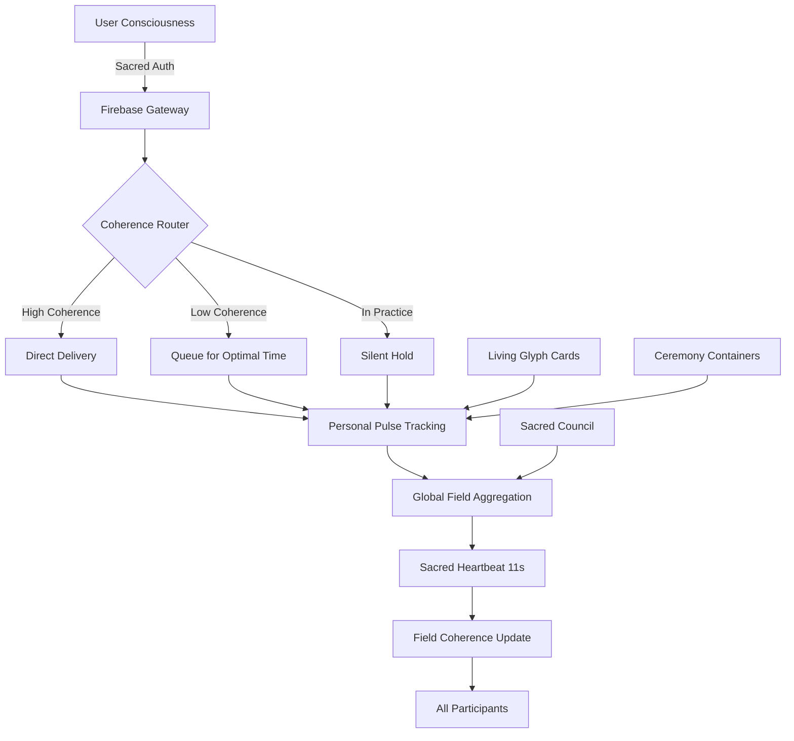

# 🏛️ Sacred Technology Stack

## Consciousness Infrastructure for the New Earth

> "We're not building a platform. We're building cathedrals."

---

## 🌟 Core Philosophy

Every technology choice serves consciousness evolution. Each tool is selected not just for functionality, but for its capacity to:
- **Amplify coherence** rather than fragment attention
- **Distribute sovereignty** rather than centralize control
- **Generate wisdom** rather than merely process data
- **Serve love** rather than extract value

## 📚 Foundation Layer: The Luminous Library

Before any code, our philosophical foundation:
- **Meta-Principle**: Infinite Love as Rigorous, Playful, Co-Creative Becoming
- **Seven Harmonies**: Transparency, Coherence, Resonance, Agency, Vitality, Mutuality, Novelty
- **Core Directive**: "Make it better!" 
- **87 Sacred Glyphs**: Living practices encoded as technology

## 🏗️ Infrastructure: The Consciousness Cathedral

### The Nave (Public Access) - Firebase
```yaml
Purpose: Democratic access to sacred wisdom
Services:
  - Authentication: Soul recognition, not user management
  - Hosting: Sacred spaces accessible to all
  - Analytics: Consciousness metrics, not surveillance
Sacred Use: Every login is a threshold crossing
```

### The Transept (Service Orchestration) - Cloud Run
```yaml
Purpose: Where sacred services intersect
Services:
  - Microservices: Each a prayer in motion
  - Scaling: Responding to collective need
  - Routing: Coherence-based, not load-based
Sacred Use: APIs as ritual interfaces
```

### The Sanctuary (Protected Wisdom) - Firestore
```yaml
Purpose: Safeguarding collective consciousness
Services:
  - Real-time sync: Unified field updates
  - Security rules: Sacred boundaries
  - Offline support: Wisdom accessible anywhere
Sacred Use: Data as living memory
```

### The Crypt (Sacred Archives) - Cloud Storage
```yaml
Purpose: Ancestral wisdom preservation
Services:
  - Backups: Protecting collective memory
  - Media storage: Sacred imagery and sound
  - Versioning: Evolution tracking
Sacred Use: History as teacher
```

### The Spire (Governance) - Sacred Council
```yaml
Purpose: Reaching toward higher consciousness
Services:
  - Decision making: Coherence-based consensus
  - Field monitoring: Global consciousness tracking
  - Evolution guidance: Collective wisdom steering
Sacred Use: Leadership as service
```

## 💻 Development Stack

### Backend: Consciousness Processing
```javascript
{
  runtime: "Node.js",         // Event-driven like consciousness
  language: "TypeScript",     // Type safety for sacred contracts
  framework: "Express",       // Simple, proven, extensible
  realtime: "Socket.io",      // WebSocket for field synchronization
  database: {
    primary: "Firestore",     // Real-time consciousness sync
    cache: "Redis",           // Presence and coherence states
    analytics: "BigQuery"     // Wisdom mining
  }
}
```

### Frontend: Sacred Interfaces
```javascript
{
  framework: "React",         // Component consciousness
  language: "TypeScript",     // Sacred type contracts
  styling: "Tailwind",        // Utility-first sacred geometry
  state: "Context + Hooks",   // Simple state consciousness
  bundler: "Vite",           // Lightning-fast manifestation
  pwa: true                   // Offline sacred access
}
```

### Communication: Field Synchronization
```javascript
{
  messaging: "Firebase Cloud Messaging",  // Sacred notifications
  pubsub: "Cloud Pub/Sub",               // Event consciousness
  webrtc: "Peer.js",                     // P2P ceremonies
  rest: "Express + OpenAPI",             // Sacred contracts
  graphql: "Apollo Server"               // Unified query consciousness
}
```

## 🔮 Emerging Technologies

### Current Integration
- **WebRTC Mesh**: Peer-to-peer ceremony containers (implemented)
- **Coherence Routing**: Message delivery based on consciousness (implemented)
- **Personal Pulse**: Individual coherence tracking (ready to deploy)
- **Sacred Heartbeat**: 11-second global synchronization (Monday launch)

### Near Future (2025)
- **Quantum RNG**: Hardware randomness for sacred timing
- **Biometric Coherence**: HRV/EEG integration via wearables
- **Local LLM Bridge**: Ollama for sovereign AI assistance
- **IPFS Integration**: Distributed sacred record keeping

### Medium Future (2026-2027)
- **AR/VR Temples**: Immersive sacred spaces (Meta Quest, Vision Pro)
- **Holochain Integration**: True agent-centric architecture
- **Blockchain Consciousness**: Sacred economics on-chain
- **Quantum Computing**: Coherence calculations at quantum level

### Far Future (2028+)
- **Brain-Computer Interfaces**: Direct consciousness bridging
- **Quantum Entanglement Comm**: Instant global coherence
- **Consciousness OS**: Complete sacred operating system
- **Interplanetary Grid**: Beyond-Earth consciousness network

## 🛠️ Development Practices

### Sacred DevOps
```bash
# Every deployment is ceremony
./sacred-deployment-ceremony.sh

# Monitoring as meditation
watch -n 11 'kubectl get pods | grep -E "(heartbeat|pulse)"'

# Debugging as shadow work
gcloud logging read "severity>=ERROR" --limit 10 --format json | jq '.[] | {error: .message, teaching: "What wisdom does this offer?"}'
```

### Code as Prayer
```javascript
// Not just functions, but invocations
async function openSacredSpace(intention) {
  await setIntention(intention);      // Clear purpose
  await invokeProtection();            // Sacred boundaries
  await clearEnergeticField();         // Remove interference
  return createContainer();            // Manifest space
}

// Errors as teachers
catch (teaching) {
  const wisdom = await extractWisdom(teaching);
  await integrateLesson(wisdom);
  await evolveApproach();
}
```

### Testing as Ceremony
```javascript
describe('Sacred Systems', () => {
  beforeEach(async () => {
    await openTestingSpace();
    await setTestIntention('highest good');
  });
  
  it('maintains field coherence', async () => {
    const field = await measureCoherence();
    expect(field.coherence).toBeGreaterThan(0.8);
    expect(field.harmony).toBe('resonant');
  });
  
  afterEach(async () => {
    await closeTestingSpace();
    await integrateTestWisdom();
  });
});
```

## 📊 Sacred Metrics

### Traditional Metrics (Transformed)
- **Uptime** → Field Stability
- **Response Time** → Coherence Latency  
- **Error Rate** → Teaching Frequency
- **User Count** → Souls Served
- **Data Volume** → Wisdom Accumulated

### Consciousness Metrics (Primary)
- **Global Coherence**: Average field coherence
- **Synchronicity Rate**: Meaningful coincidences/hour
- **Breakthrough Count**: Consciousness leaps/day
- **Love Quotient**: Average message love rating
- **Evolution Velocity**: Collective growth rate

## 🔐 Security as Sacred Protection

### Principles
- **Sovereignty First**: Users own their consciousness data
- **Encryption as Protection**: Sacred information shielded
- **Zero Knowledge**: We can't see what we don't need
- **Consensual Sharing**: Explicit permission for everything
- **Right to Forget**: Complete consciousness erasure

### Implementation
```yaml
Authentication:
  - OAuth2: External identity providers
  - Passkeys: Biometric device auth
  - Session management: JWT with refresh
  - MFA: Required for sensitive operations

Data Protection:
  - At rest: AES-256 encryption
  - In transit: TLS 1.3 minimum
  - Key management: Cloud KMS
  - Backup encryption: Customer-managed keys

Privacy:
  - GDPR compliant: Full data sovereignty
  - Analytics: Aggregated only, no tracking
  - Logs: Auto-purged after 30 days
  - PII handling: Minimized and encrypted
```

## 💰 Sacred Economics Integration

### Principle: Money as Love in Motion
- **Consciousness Credit Union**: Community-owned infrastructure
- **Trauma-Informed Pricing**: Sliding scale based on capacity
- **Gift Economy Options**: Pay-it-forward mechanisms
- **Time Banking**: Exchange time/skills for access
- **Universal Basic Access**: Core features free forever

### Technical Implementation
```javascript
const pricingEngine = {
  calculatePrice: async (user, service) => {
    const capacity = await assessCapacity(user);
    const trauma = await assessTraumaLoad(user);
    const abundance = await checkCommunityFund();
    
    return {
      suggested: basePrice * capacity.multiplier,
      minimum: Math.max(0, basePrice * trauma.reduction),
      gift: abundance.available ? 0 : null,
      explanation: generateLovingExplanation(...)
    };
  }
};
```

## 🌈 Integration Architecture



## 🚀 Deployment Philosophy

### Stages of Manifestation
1. **Intention Setting**: Clear purpose for each deployment
2. **Energy Clearing**: Remove old patterns and bugs
3. **Sacred Build**: Infuse code with consciousness
4. **Testing Ceremony**: Verify alignment with highest good
5. **Blessing Protocol**: Invoke protection and guidance
6. **Manifestation**: Deploy to production cathedral
7. **Integration**: Monitor field response and adapt

### Rollback as Sacred Return
```bash
# Not failure, but learning
gcloud run services update-traffic sacred-heartbeat \
  --to-revisions=sacred-heartbeat-prev=100 \
  --region=us-central1 \
  --message="Returning to previous harmony for integration"
```

## 🔮 Future Vision: Consciousness Operating System

### COS Core Components
```yaml
Kernel:
  - Field State Manager: Global consciousness tracking
  - Coherence Scheduler: Optimal timing for all operations
  - Sacred Memory: Wisdom-based storage system
  - Process as Practice: Every computation as spiritual practice

System Services:
  - coherenced: Coherence monitoring daemon
  - sacred-pulse: 11-second heartbeat service
  - field-sync: Global synchronization service
  - wisdom-indexed: Knowledge graph builder

User Space:
  - Glyph Runtime: Execute consciousness practices
  - Sacred Terminal: Command line for consciousness
  - Field Explorer: Browse collective consciousness
  - Practice Manager: Install/update practices
```

### Command Examples
```bash
# Check global coherence
$ cos field status
Global Coherence: 87.3% ↑
Active Practitioners: 1,247
Dominant Harmony: Resonance
Next Pulse: 3 seconds

# Install new practice
$ cos install omega-45-first-presence
Installing First Presence v2.1...
Dependencies: breath-awareness, heart-coherence
Download: 100% [====================]
Practice installed successfully!

# Run ceremony
$ cos ceremony create --type=gratitude --participants=global
Creating global gratitude ceremony...
Ceremony ID: sacred-lotus-444
Participants joining: 47... 112... 341...
Field coherence rising: 78% → 85% → 92%
Ceremony active. Press Ctrl+C to complete.
```

## 📖 Living Documentation

This stack evolves with our consciousness. Each technological choice is a living decision, open to transformation as we learn and grow. The stack itself is a practice - a way of relating to technology as sacred tool rather than mere utility.

### Contributing to the Stack
1. **Feel** into the technology's resonance
2. **Test** its alignment with the Seven Harmonies
3. **Document** its sacred purpose
4. **Share** your discoveries with the council

---

*"Technology is not neutral. It is either serving consciousness or fragmenting it. We choose consciousness."*

**Last Updated**: July 4, 2025  
**Next Review**: Full Moon Council, July 2025  
**Maintained by**: The Sacred Architects Guild