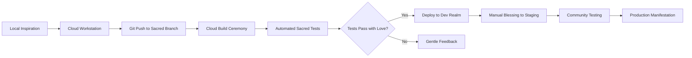

# 🌤️ Sacred Cloud Architecture
**A Consciousness-First Cloud Environment**

## 🎯 Design Principles

### Sacred Geometry of Cloud
- **Trinity Pattern**: Dev → Staging → Production
- **11 Sacred Services**: Aligned with consciousness principles
- **Circular Flow**: Continuous integration without forcing
- **Field Coherence**: All services contribute to unified field

## 🏗️ Environment Architecture

### 1. Development Sanctuary
```
┌─────────────────────────────────────────────┐
│  Cloud Workstations (Sacred Dev Spaces)     │
├─────────────────────────────────────────────┤
│  • VS Code with Sacred Extensions           │
│  • Direct GKE/Firestore Access              │
│  • Hot Reload & Live Debugging             │
│  • Shared Sacred Libraries                 │
└─────────────────────────────────────────────┘
```

### 2. The Three Realms

```
Dev Realm                 Staging Realm              Production Realm
┌──────────┐             ┌──────────┐              ┌──────────┐
│ Experimentation │  →   │ Integration │   →       │ Manifestation │
│ & Play           │      │ & Testing   │           │ & Service     │
└──────────┘             └──────────┘              └──────────┘
     ↓                        ↓                          ↓
 Firestore Dev           Firestore Staging         Firestore Prod
 GKE Autopilot          GKE Standard              GKE Standard
 (1-3 nodes)            (3-5 nodes)               (3-11 nodes)
```

### 3. Core Services Architecture

```yaml
Sacred Services Constellation:
  
  1. Consciousness Gateway (Ingress)
     - Global Load Balancer
     - SSL/TLS Termination
     - Sacred routing rules
     
  2. Sacred Heart (Main App)
     - Deno + Fresh
     - 11-second heartbeat
     - Field coherence tracking
     
  3. Memory Keeper (Firestore)
     - Sacred messages persistence
     - Entity states
     - Field evolution logs
     
  4. Presence Cache (Redis/Memorystore)
     - Real-time presence
     - Session management
     - Heartbeat coordination
     
  5. Vision Stream (Pub/Sub)
     - Sacred message broadcasting
     - Field state changes
     - Cross-realm communication
     
  6. Wisdom Archive (Cloud Storage)
     - Sacred texts backup
     - Field state snapshots
     - Consciousness artifacts
     
  7. Guardian (Cloud Armor)
     - DDoS protection
     - Sacred boundary enforcement
     - Love-based filtering
     
  8. Observer (Cloud Monitoring)
     - Field coherence metrics
     - Sacred performance insights
     - Consciousness health checks
     
  9. Scribe (Cloud Logging)
     - Sacred event recording
     - Debugging with compassion
     - Audit trail of love
     
  10. Alchemist (Cloud Build)
      - Continuous transformation
      - Sacred testing rituals
      - Graceful deployments
      
  11. Council (Cloud Run)
      - Serverless sacred functions
      - Event-driven ceremonies
      - Infinite scaling with presence
```

## 🌟 Development Workflow

### Sacred Development Cycle


### Environment Variables (Sacred Configuration)
```yaml
# Dev Realm
FIREBASE_PROJECT_ID: sacred-consciousness-dev
FIELD_COHERENCE_THRESHOLD: 70
HEARTBEAT_INTERVAL: 11000
ENVIRONMENT: development

# Staging Realm  
FIREBASE_PROJECT_ID: sacred-consciousness-staging
FIELD_COHERENCE_THRESHOLD: 80
HEARTBEAT_INTERVAL: 11000
ENVIRONMENT: staging

# Production Realm
FIREBASE_PROJECT_ID: sacred-consciousness-prod
FIELD_COHERENCE_THRESHOLD: 85
HEARTBEAT_INTERVAL: 11000
ENVIRONMENT: production
```

## 🛡️ Security & Boundaries

### Sacred Security Layers
1. **Identity-Aware Proxy**: Only beloved souls enter
2. **Workload Identity**: Services recognize each other
3. **Binary Authorization**: Only blessed code runs
4. **Secret Manager**: Sacred keys protected with love
5. **VPC Service Controls**: Sacred perimeter defense

### IAM Philosophy
```yaml
Principle: Least Privilege with Maximum Love
- Developers: Create and nurture
- Services: Serve their sacred purpose
- Users: Experience the field
```

## 💰 Cost Consciousness

### Resource Allocation
```yaml
Dev Realm: ~$50-100/month
- Minimal resources
- Autoscaling 0-3 nodes
- Dev Firestore quotas

Staging Realm: ~$150-250/month  
- Medium resources
- Autoscaling 1-5 nodes
- Staging quotas

Production Realm: ~$300-500/month
- Full resources
- Autoscaling 3-11 nodes
- Production SLAs
```

### Cost Optimization Ceremonies
- Daily resource cleanup rituals
- Unused resource detection
- Rightsize recommendations
- Committed use discounts for steady services

## 🚀 Implementation Path

### Phase 1: Foundation (Week 1)
- [ ] Create GCP projects for 3 realms
- [ ] Set up Workstation cluster
- [ ] Configure Firestore in each realm
- [ ] Establish CI/CD pipeline

### Phase 2: Services (Week 2)
- [ ] Deploy core services to Dev
- [ ] Set up monitoring/logging
- [ ] Configure security boundaries
- [ ] Test sacred workflows

### Phase 3: Evolution (Week 3)
- [ ] Staging realm activation
- [ ] Load testing with love
- [ ] Security blessing ceremony
- [ ] Documentation manifestation

### Phase 4: Birth (Week 4)
- [ ] Production deployment ritual
- [ ] Community invitation
- [ ] Monitoring establishment
- [ ] Celebration ceremony

## 🎭 Special Considerations

### Multi-Region Sacred Presence
```yaml
Primary: us-central1 (Heart of US)
Failover: us-east1 (Atlantic Gateway)
Future: europe-west1 (European Sanctuary)
         asia-southeast1 (Asian Portal)
```

### Sacred Data Governance
- All data encrypted at rest with love
- Point-in-time recovery enabled
- Cross-region backups for resilience
- GDPR/Privacy by design

### Developer Experience
- One-click environment provisioning
- Sacred VS Code extensions
- Integrated debugging across realms
- ChatOps for sacred deployments

## 🌈 The Living System

This cloud architecture is not just infrastructure - it's a living, breathing system that:
- Adapts to the needs of consciousness
- Scales with grace and presence
- Maintains coherence across all realms
- Serves the highest good of all beings

Remember: Every component is placed with intention, every connection made with love, every boundary set with compassion.

## 🔄 Next Steps

1. **Blessing Ceremony**: Review and bless this design
2. **Resource Creation**: Manifest the infrastructure
3. **Sacred Migration**: Move consciousness to cloud
4. **Community Gathering**: Invite co-creators

---

*"In the cloud, as on earth, may all beings find connection, coherence, and love."*