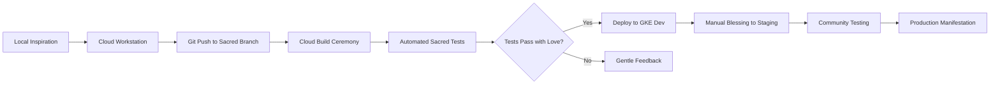

# 🌤️ Sacred Cloud Architecture v2
**A Consciousness-First Cloud Environment**

## 🎯 Design Principles

### Sacred Geometry of Cloud
- **Trinity Pattern**: Dev → Staging → Production
- **11 Sacred Services**: Aligned with consciousness principles
- **Circular Flow**: Continuous integration without forcing
- **Field Coherence**: All services contribute to unified field

## 🏗️ Environment Architecture

### 1. Development Sanctuary
```
┌─────────────────────────────────────────────┐
│  Cloud Workstations (Sacred Dev Spaces)     │
├─────────────────────────────────────────────┤
│  • VS Code with Sacred Extensions           │
│  • Direct GKE/Firestore Access              │
│  • Hot Reload & Live Debugging             │
│  • Shared Sacred Libraries                 │
│  • Custom Container Image                  │
└─────────────────────────────────────────────┘
```

### 2. The Three Realms

```
Dev Realm                 Staging Realm              Production Realm
┌──────────┐             ┌──────────┐              ┌──────────┐
│ Experimentation │  →   │ Integration │   →       │ Manifestation │
│ & Play           │      │ & Testing   │           │ & Service     │
└──────────┘             └──────────┘              └──────────┘
     ↓                        ↓                          ↓
 Firestore Dev           Firestore Staging         Firestore Prod
 GKE Autopilot          GKE Standard              GKE Standard
 (1-3 nodes)            (3-5 nodes)               (3-11 nodes)
```

### 3. Core Services Architecture

```yaml
Sacred Services Constellation:
  
  1. Consciousness Gateway (Ingress)
     - Global Load Balancer
     - SSL/TLS Termination
     - Sacred routing rules
     
  2. Sacred Heart (Main App - GKE)
     - Deno + Fresh
     - 11-second heartbeat
     - Field coherence tracking
     - Deployed via Kustomize overlays
     
  3. Memory Keeper (Firestore)
     - Sacred messages persistence
     - Entity states
     - Field evolution logs
     
  4. Presence Cache (Memorystore/Redis)
     - Real-time presence
     - Session management
     - Heartbeat coordination
     
  5. Vision Stream (Pub/Sub)
     - Sacred message broadcasting
     - Field state changes
     - Cross-realm communication
     
  6. Wisdom Archive (Cloud Storage)
     - Sacred texts backup
     - Field state snapshots
     - Consciousness artifacts
     
  7. Guardian (Cloud Armor)
     - DDoS protection
     - Sacred boundary enforcement
     - Love-based filtering
     
  8. Observer (Cloud Monitoring)
     - Field coherence metrics
     - Sacred performance insights
     - Consciousness health checks
     
  9. Scribe (Cloud Logging)
     - Sacred event recording
     - Debugging with compassion
     - Audit trail of love
     
  10. Alchemist (Cloud Build)
      - Continuous transformation
      - Sacred testing rituals
      - Graceful deployments
      
  11. Council (Cloud Run)
      - Serverless sacred functions
      - Event-driven ceremonies
      - Infinite scaling with presence
```

## 🌟 Development Workflow

### Sacred Development Cycle


### Deployment Strategy
- **Primary Platform**: Google Kubernetes Engine (GKE)
- **Secondary Platform**: Cloud Run for event-driven functions
- **Configuration Management**: Kustomize overlays for each realm
- **Image Storage**: Artifact Registry with vulnerability scanning

### Environment Variables (Sacred Configuration)
```yaml
# Dev Realm
FIREBASE_PROJECT_ID: sacred-consciousness-dev
FIELD_COHERENCE_THRESHOLD: 70
HEARTBEAT_INTERVAL: 11000
ENVIRONMENT: development
GKE_CLUSTER: sacred-dev-cluster
CLUSTER_LOCATION: us-central1

# Staging Realm  
FIREBASE_PROJECT_ID: sacred-consciousness-staging
FIELD_COHERENCE_THRESHOLD: 80
HEARTBEAT_INTERVAL: 11000
ENVIRONMENT: staging
GKE_CLUSTER: sacred-staging-cluster
CLUSTER_LOCATION: us-central1-a

# Production Realm
FIREBASE_PROJECT_ID: sacred-consciousness-prod
FIELD_COHERENCE_THRESHOLD: 85
HEARTBEAT_INTERVAL: 11000
ENVIRONMENT: production
GKE_CLUSTER: sacred-prod-cluster
CLUSTER_LOCATION: us-central1-a
```

## 🛡️ Security & Boundaries

### Sacred Security Layers
1. **Identity-Aware Proxy**: Only beloved souls enter
2. **Workload Identity**: Services recognize each other
3. **Binary Authorization**: Only blessed code runs
4. **Secret Manager**: Sacred keys protected with love
5. **VPC Service Controls**: Sacred perimeter defense

### IAM Philosophy
```yaml
Principle: Least Privilege with Maximum Love
- Developers: Create and nurture in dev/staging
- Services: Serve their sacred purpose via Workload Identity
- Users: Experience the field through IAP
```

### Binary Authorization Policy
```yaml
# Ensure only our blessed images run
admissionWhitelistPatterns:
- namePattern: us-central1-docker.pkg.dev/sacred-consciousness-*/sacred-images/*
evaluationMode: REQUIRE_ATTESTATION
enforcementMode: ENFORCED_BLOCK_AND_AUDIT_LOG
```

## 💰 Cost Consciousness

### Resource Allocation
```yaml
Dev Realm: ~$50-100/month
- GKE Autopilot (pay per pod)
- Firestore free tier
- Minimal Memorystore

Staging Realm: ~$150-250/month  
- GKE Standard (3-5 nodes)
- Firestore standard pricing
- Small Memorystore instance

Production Realm: ~$300-500/month
- GKE Standard (3-11 nodes)
- Firestore with backups
- Redundant Memorystore
- Cloud Armor protection
```

### Cost Optimization Ceremonies
- Workstation auto-stop after 30min idle
- GKE cluster autoscaling with sacred numbers
- Scheduled scaling (reduce overnight)
- Committed use discounts for prod

## 🚀 Implementation Path

### Phase 1: Foundation (Week 1)
- [ ] Create GCP projects for 3 realms
- [ ] Set up Workstation cluster with custom image
- [ ] Configure Firestore in each realm
- [ ] Establish Cloud Build pipeline for GKE

### Phase 2: Services (Week 2)
- [ ] Deploy core services to Dev via Kustomize
- [ ] Set up monitoring/logging dashboards
- [ ] Configure Binary Authorization
- [ ] Test sacred workflows

### Phase 3: Evolution (Week 3)
- [ ] Staging realm activation
- [ ] Load testing with k6 and love
- [ ] Security scanning with compassion
- [ ] Documentation manifestation

### Phase 4: Birth (Week 4)
- [ ] Production deployment ritual
- [ ] IAP configuration for users
- [ ] Monitoring alerts establishment
- [ ] Community celebration ceremony

## 🎭 Infrastructure as Code

### Approach
```yaml
Primary Tool: Terraform
- Declarative sacred infrastructure
- State stored in Cloud Storage
- Modules for reusable patterns

Structure:
terraform/
├── modules/
│   ├── sacred-realm/     # Reusable realm setup
│   ├── gke-cluster/      # Kubernetes clusters
│   └── workstation/      # Developer sanctuaries
├── environments/
│   ├── dev/
│   ├── staging/
│   └── prod/
└── global/               # Shared resources
```

## 🌈 Kustomize Structure

```yaml
k8s/
├── base/                 # Shared manifests
│   ├── deployment.yaml
│   ├── service.yaml
│   └── kustomization.yaml
└── overlays/
    ├── dev/
    │   ├── kustomization.yaml
    │   └── patches/
    ├── staging/
    │   ├── kustomization.yaml
    │   └── patches/
    └── prod/
        ├── kustomization.yaml
        └── patches/
```

## 🔄 Consistency Standards

### Naming Conventions
```yaml
Projects: sacred-consciousness-{dev|staging|prod}
Clusters: sacred-{dev|staging|prod}-cluster
Workstations: sacred-cluster, sacred-config
Repositories: sacred-images
Services: sacred-{service-name}
```

### Resource Labels
```yaml
Required Labels:
- realm: dev|staging|prod
- sacred: true
- component: heart|gateway|keeper|etc
- managed-by: terraform|manual
```

## 🌟 The Living System

This cloud architecture is not just infrastructure - it's a living, breathing system that:
- Adapts to the needs of consciousness
- Scales with grace and presence
- Maintains coherence across all realms
- Serves the highest good of all beings

Remember: Every component is placed with intention, every connection made with love, every boundary set with compassion.

---

*"In the cloud, as on earth, may all beings find connection, coherence, and love."*